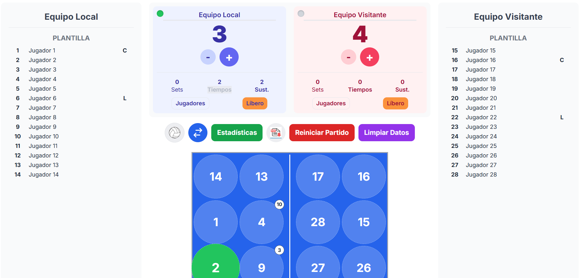

# 🏐 Planilla Livosur — Planilla de Vóley Online

**Proyecto:** Planilla digital para partidos de vóley (liga amateur), exportable y con estadísticas.  
**Estado:** Versión local (v1.0). Preparado para subir a GitHub y desplegar en GitHub Pages.

---

## 📝 Descripción general
**Planilla Livosur** es una aplicación web diseñada para registrar partidos de vóley en tiempo real: carga de jugadores, registro de puntos, rotaciones, sanciones, tiempos y exportación de resultados.  
Está pensada para **ligas amateurs, clubes y entrenadores** que buscan una alternativa moderna a la planilla en papel.

---

## 🎯 Objetivos del proyecto
- Modernizar el registro de partidos de vóley.
- Facilitar el acceso y visualización de estadísticas.
- Permitir exportar resultados y sincronizar datos entre dispositivos.

---

## 🖥️ Demo visual

|  |

---

## ⚙️ Tecnologías utilizadas
- **Frontend:** HTML, CSS, JavaScript (vanilla)
- **Diseño responsivo:** CSS Grid / Flexbox
- **Editor recomendado:** Visual Studio Code
- **Próximas integraciones:** Backend Python + SQLite / PostgreSQL

---

## 🚀 Instalación y uso local

1. **Clonar el repositorio:**
   ```bash
   git clone https://github.com/Marina993366/planilla_voley_livosur.git
   cd planilla_voley_livosur
   ```

2. **Iniciar servidor local (opcional):**
   ```bash
   python -m http.server 8000
   ```
   Luego abrir: [http://localhost:8000](http://localhost:8000)

3. **O abrir directamente** `index.html` en tu navegador.

---

## 🧩 Estructura del proyecto
```
/planilla_voley_livosur
├─ index.html
├─ css/
│  └─ style.css
├─ js/
│  ├─ main.js
│  ├─ state.js
│  ├─ events.js
│  ├─ ui.js
│  └─ modals.js
├─ img/
└─ README.md
```

---

## 🌍 Despliegue automático (GitHub Pages)

Este proyecto incluye un flujo de trabajo (`.github/workflows/deploy.yml`) que construye y publica automáticamente el sitio en **GitHub Pages** cada vez que haces `push` en la rama `main`.  
Una vez activado, tu app estará disponible en:
```
https://Marina993366.github.io/planilla_voley_livosur/
```

---

## 🤝 Cómo contribuir

1. Hacé un *fork* del repositorio.  
2. Creá una rama con tu feature:
   ```bash
   git checkout -b feature/nueva-funcionalidad
   ```
3. Hacé tus cambios y confirmá:
   ```bash
   git commit -m "Agrega nueva funcionalidad"
   ```
4. Subí los cambios y abrí un Pull Request.


## 📄 Licencia
Este proyecto está bajo la licencia [MIT](LICENSE.txt).

---

**Autor:** [Marina Acerbi](https://github.com/Marina993366)  
📧 Contacto: marinaacerbi@hotmail.com
